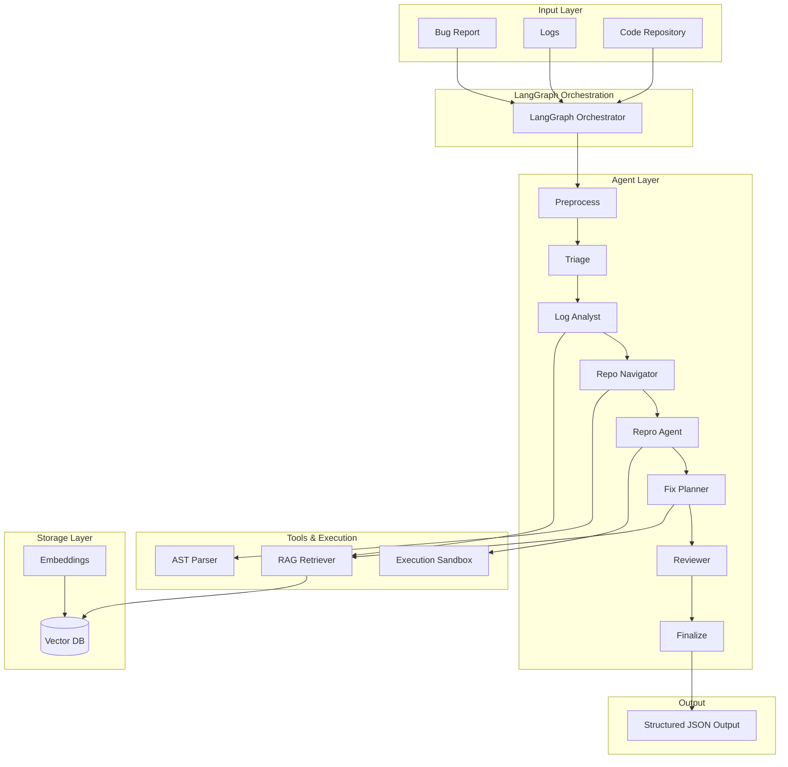

# AI Multi-Agent Debugger

A production-grade multi-agent system that ingests bug reports and logs, reproduces the issue via a generated minimal script, and outputs a structured root-cause hypothesis + patch plan.

## Quick Start

```bash
cd ai_debugger
pip install -r requirements.txt

# Full run with mock repo
python main.py `
  --bug-report mock_repo/bug_report.json `
  --logs mock_repo/logs/production.log `
  --repo mock_repo

# Streamlit UI
streamlit run app/streamlit_app.py
```

## Architecture


## Features

- **Multi-Agent Debugging Pipeline**  
  Uses LangGraph to orchestrate specialized agents (Triage, Log Analyst, Repo Navigator, Repro, Fix Planner, Reviewer) for end-to-end debugging.

- **Multi-File Codebase Analysis**  
  Analyzes entire repositories (not just single files) using AST parsing and semantic retrieval to locate relevant code across modules.

- **RAG-Based Code Retrieval**  
  Combines FAISS vector search with keyword matching to fetch context-aware code snippets for accurate reasoning.

- **Automated Bug Reproduction**  
  Generates minimal reproducible scripts and executes them in a sandboxed environment to validate failures.

- **Root Cause Analysis & Patch Planning**  
  Produces structured root-cause hypotheses and actionable patch plans grounded in logs and code evidence.

- **Structured JSON Output**  
  Outputs detailed reports including bug summary, evidence, repro steps, root cause, patch plan, and validation strategy.

- **Resilient Execution & Fallbacks**  
  Handles missing logs, partial inputs, and agent failures with graceful degradation and heuristic fallbacks.

- **LLM + Heuristic Hybrid System**  
  Uses LLaMA (via Ollama) for reasoning with fallback to deterministic logic when LLM is unavailable.

- **Observability & Debug Tracing**  
  Logs all agent decisions, tool calls, and execution traces for transparency and debugging.

  
## Folder Structure

```
ai_debugger/
├── main.py # Entry point (CLI)
├── app/ # Streamlit UI
├── orchestrator/ # LangGraph pipeline + state
├── agents/ # Core debugging agents
├── tools/ # AST parsing, execution, log parsing
├── rag/ # Embeddings + FAISS retrieval
├── validation/ # Output validation & confidence scoring
├── utils/ # LLM client, logging, formatting
├── outputs/ # Generated repros, reports, logs
└── mock_repo/ # Test codebase with bugs
```

## Agent Roles

| Agent | Responsibility |
|-------|---------------|
| **Triage** | Extracts symptoms, expected/actual behavior, environment, hypotheses |
| **Log Analyst** | Parses stack traces, ranks errors by frequency, detects anomalies |
| **Repo Navigator** | Maps traces to source via AST + FAISS semantic search |
| **Repro Agent** | Generates + executes minimal failing script with retries/fallback |
| **Fix Planner** | Root-cause hypothesis + patch plan grounded in evidence |
| **Reviewer** | Challenges assumptions, detects contradictions, validates fix safety |

## LLM Configuration

The system uses **Ollama** (LLaMA 3.2) for enhanced analysis. Without Ollama it falls back to heuristic analysis automatically.

```bash
# Install Ollama
curl -fsSL https://ollama.ai/install.sh | sh
ollama pull llama3.2

# Then run with LLM active
python main.py --bug-report mock_repo/bug_report.json --logs mock_repo/logs/production.log
```

Environment variables:
```bash
OLLAMA_BASE_URL=http://localhost:11434   # default
OLLAMA_MODEL=llama3.2                    # default
OLLAMA_TIMEOUT=120                       # seconds
OLLAMA_TEMPERATURE=0.1                   # deterministic
```

## Output Format

```json
{
  "bug_summary": { "title", "severity", "symptoms", "environment", "impact" },
  "evidence": [ { "type": "stack_trace|log_error|anomaly", ... } ],
  "repro": { "file", "command", "status", "output", "bug_confirmed" },
  "root_cause": { "hypothesis", "mechanism", "confidence", "bug_type" },
  "patch_plan": { "summary", "files_to_change", "code_change", "risks" },
  "validation_plan": { "validation_steps", "regression_tests", "edge_cases" },
  "open_questions": [ "..." ],
  "metadata": { "pipeline_confidence", "agent_trace", "review_recommendation" }
}
```

## Traces / Logs

All agent decisions and tool calls are logged to:
- **Console**: `stdout` with timestamps
- **File**: `outputs/logs/pipeline.log`
- **JSON**: `metadata.agent_trace` in report

The `agent_trace` in the output JSON contains per-agent status, duration, and any errors.

## Mock Repository Bugs

The `mock_repo/` contains a realistic fintech platform with 5 intentional bugs:

| Bug | File | Type | Severity |
|-----|------|------|----------|
| BUG-2847 | `payments/processor.py:58` | Float precision in `to_minor_units()` | CRITICAL |
| BUG-2801 | `database/connection_pool.py:89` | Race condition in `acquire()` | HIGH |
| BUG-2756 | `auth/auth_service.py:65` | JWT leeway=-1 causes premature expiry | HIGH |
| BUG-2799 | `api/router.py:70-110` | Memory leak + deadlock in RateLimiter | MEDIUM |
| BUG-2812 | `utils/cache.py:50` | TOCTOU race in TTLCache.get() | MEDIUM |

## Failure Handling

| Case | Behavior |
|------|----------|
| Empty bug report | Continues with minimal context, adds warning |
| No logs | Skips log analysis, proceeds with report |
| No repo | Skips repo navigator, generates standalone repro |
| Repro fails (import error) | Retries once with PYTHONPATH set |
| Repro fails (all modes) | Falls back to pattern-matched template repro |
| LLM unavailable | Full heuristic fallback, all agents still run |
| Agent crash | Isolated — error logged, pipeline continues |
| Tool failure | Error recorded in state, next agent proceeds |

## Running Tests

```bash
# Mock repo test suite (tests the payment precision bug)
pytest mock_repo/tests/ -v

# Pipeline edge cases
python -c "
from orchestrator.graph import run_pipeline
# Edge case: empty inputs
s = run_pipeline({}, '', '')
assert s['confidence'] >= 0, 'Should not crash on empty inputs'
print('Edge case tests passed')
"
```
